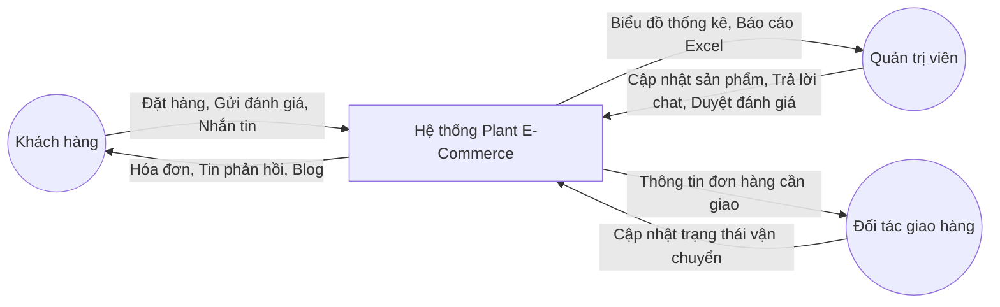
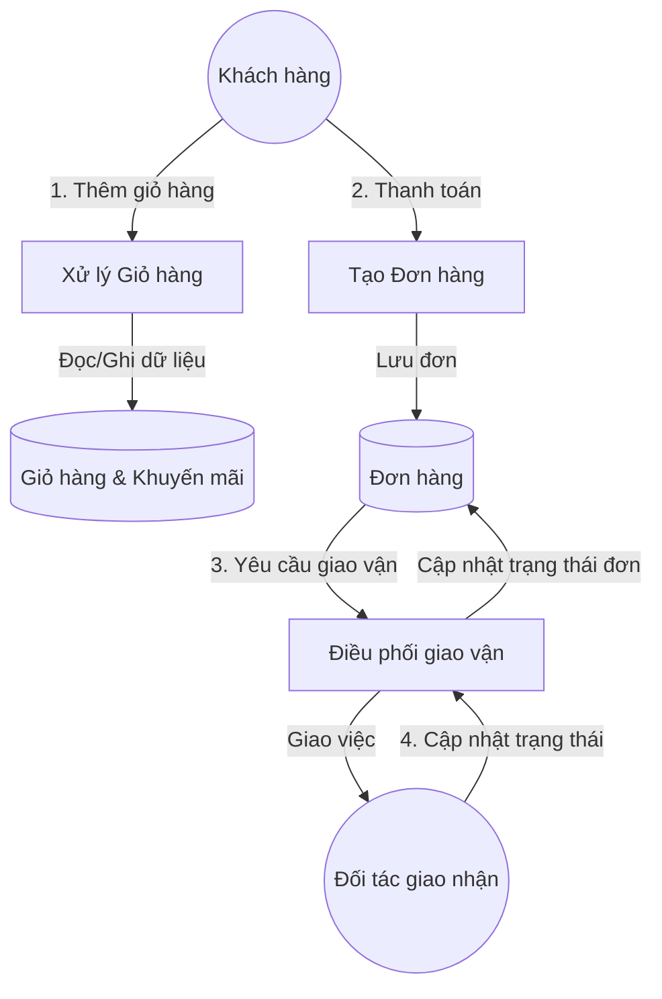

# BÁO CÁO ĐỒ ÁN: HỆ THỐNG THƯƠNG MẠI ĐIỆN TỬ BÁN CÂY CẢNH (PLANT E-COMMERCE)

> [!NOTE]
> Tài liệu này được biên soạn dựa trên cấu trúc thực tế của codebase dự án **Plant E-Commerce**, sử dụng công nghệ Next.js (Frontend), NestJS (Backend), MongoDB (Database) và Socket.io (Realtime Chat).

---

## Chương I. MÔ TẢ, KHẢO SÁT VÀ XÁC ĐỊNH YÊU CẦU BÀI TOÁN

### 1.1 Mô tả bài toán
Trong bối cảnh đô thị hóa nhanh chóng, nhu cầu trồng cây cảnh, trang trí không gian xanh tại nhà và văn phòng ngày càng tăng cao. Tuy nhiên, việc mua bán cây cảnh truyền thống gặp nhiều rào cản về khoảng cách địa lý, vận chuyển khó khăn và thiếu sự tư vấn chăm sóc cây 24/7. 

Hệ thống **Plant E-Commerce** được xây dựng nhằm giải quyết bài toán trên bằng cách cung cấp một nền tảng thương mại điện tử chuyên biệt về cây cảnh với các đặc thù:
- **Khách hàng**: Dễ dàng xem danh mục cây, lọc theo các tiêu chí (độ nổi bật, khuyến mãi, khoảng giá), đặt hàng trực tuyến, thanh toán, theo dõi trạng thái giao hàng, tham khảo kiến thức qua blog và tương tác trực tiếp với hệ thống tư vấn thông qua Chatbot tích hợp link hoặc chat trực tiếp với nhân viên hỗ trợ.
- **Nhân viên giao hàng (Delivery Partner)**: Có giao diện riêng để nhận đơn hàng được phân phối và cập nhật trạng thái vận chuyển theo thời gian thực (đảm bảo không bị chuyển ngược trạng thái từ "Đã giao" về "Đang chuẩn bị").
- **Quản trị viên (Admin)**: Quản lý toàn bộ vòng đời sản phẩm, phân tích kinh doanh trực quan qua biểu đồ doanh thu và phân bố trạng thái đơn hàng, cấu hình linh hoạt giao diện trang chủ, quản lý mã giảm giá, bài viết blog, và phê duyệt/phản hồi các đánh giá của khách hàng.

### 1.2 Khảo sát, xác định yêu cầu bài toán

#### 1.2.1 Yêu cầu phi chức năng
- **Hiệu năng (Performance)**: Hệ thống phản hồi nhanh, giao diện Client và Admin được tối ưu hóa tải trang dưới 2 giây. Các tác vụ nặng như thống kê doanh thu được xử lý thông qua MongoDB Aggregation tối ưu.
- **Khả dụng & Bảo mật**: Xác thực người dùng bằng JWT Token lưu trữ an toàn trong Cookie, bảo vệ tài khoản quản trị. Tích hợp Cloudflare Turnstile để chống Spam/DDoS ở luồng đăng ký/đăng nhập.
- **Độ tương thích (Responsive)**: Giao diện hiển thị tốt trên cả máy tính (Desktop) và thiết bị di động (Mobile).
- **Tính toàn vẹn dữ liệu**: Ràng buộc chặt chẽ trạng thái đơn hàng (ví dụ: Admin không thể đổi trạng thái đơn hàng khi đối tác giao hàng đã đánh dấu là "Đã giao" hoặc "Trả hàng").

#### 1.2.2 Yêu cầu chức năng
Hệ thống phân chia thành 3 phân hệ chính:

##### A. Phân hệ Khách hàng (Client Website)
- **Đăng ký / Đăng nhập / Đăng xuất**: Xác thực người dùng, bảo vệ bằng Turnstile Captcha.
- **Xem & Tìm kiếm sản phẩm**: Lọc sản phẩm theo danh mục, mức giá, khuyến mãi, độ nổi bật.
- **Giỏ hàng & Đặt hàng**: Thêm/sửa số lượng sản phẩm trong giỏ, áp dụng mã giảm giá (Discount Code), điền thông tin địa chỉ giao hàng.
- **Đánh giá sản phẩm (Review)**: Viết đánh giá sản phẩm (số sao, nội dung, tải lên hình ảnh đính kèm), xem các đánh giá được duyệt và câu trả lời của Admin.
- **Tin tức & Blog**: Đọc các bài viết chia sẻ kinh nghiệm chăm sóc cây cảnh.
- **Hỗ trợ trực tuyến**: Chatbot tự động gợi ý sản phẩm, hỗ trợ click trực tiếp liên kết ngoài. Người dùng có thể chuyển đổi sang chat trực tiếp với Admin thông qua WebSockets.

##### B. Phân hệ Quản trị viên (Admin Dashboard)
- **Tổng quan (Dashboard)**: Biểu đồ doanh thu (Revenue Chart) trực quan và biểu đồ phân bổ trạng thái đơn hàng (OrderStatus Distribution Chart).
- **Quản lý Cây cảnh (Plants)**: Thêm mới, cập nhật thông tin cây (tên, giá, hình ảnh, khuyến mãi, nổi bật, số lượng tồn kho), hỗ trợ soft-delete (ẩn sản phẩm thay vì xóa cứng).
- **Quản lý Đơn hàng (Orders)**: Tiếp nhận đơn hàng mới, chỉ định đơn hàng cho đối tác vận chuyển và theo dõi lộ trình.
- **Quản lý Bài viết (Blogs)**: Viết và đăng bài viết, hỗ trợ bộ soạn thảo WYSIWYG, hiển thị gọn gàng danh sách bài viết.
- **Quản lý Mã giảm giá (Discounts)**: Tạo mã giảm giá theo tỷ lệ `%` hoặc số tiền cố định, thiết lập ngày bắt đầu và kết thúc.
- **Quản lý Đánh giá (Reviews)**: Duyệt, xóa hoặc viết câu trả lời trực tiếp cho đánh giá của khách hàng.
- **Hỗ trợ khách hàng (Chat)**: Giao diện chat thời gian thực (Realtime Chat) với khách hàng, có bộ lọc các cuộc hội thoại rác và đếm số lượng tin nhắn chờ phản hồi.

##### C. Phân hệ Đối tác giao hàng (Delivery Partner Portal)
- **Danh sách đơn hàng**: Xem các đơn hàng được chỉ định vận chuyển.
- **Cập nhật trạng thái**: Chuyển trạng thái giao hàng theo luồng tuyến tính (`Chuẩn bị` $\rightarrow$ `Đang giao` $\rightarrow$ `Đã giao` hoặc `Đã hủy/Trả lại`).

---

## Chương II. KIẾN THỨC ÁP DỤNG

### 2.1. Phân tích & thiết kế hệ thống

#### 2.1.1 Biểu đồ phân cấp chức năng (BFD)
Hệ thống được chia thành 4 nhánh chức năng lớn cấp 1:

```mermaid
graph TD
    System[Hệ thống Plant E-Commerce] --> Authenticate[1. Xác thực & Tài khoản]
    System --> Store[2. Phân hệ Cửa hàng & Khách hàng]
    System --> Admin[3. Phân hệ Quản trị Admin]
    System --> Delivery[4. Phân hệ Giao vận]

    Authenticate --> Register[Đăng ký & Captcha]
    Authenticate --> Login[Đăng nhập JWT]
    Authenticate --> Profile[Cập nhật Profile & Địa chỉ]

    Store --> Search[Tìm kiếm & Lọc sản phẩm]
    Store --> Cart[Quản lý Giỏ hàng & Voucher]
    Store --> Checkout[Đặt hàng & Thanh toán]
    Store --> Review[Đánh giá sản phẩm]
    Store --> ChatUser[Chatbot & Chat trực tuyến]

    Admin --> Overview[Biểu đồ Thống kê KPI]
    Admin --> ManagePlants[Quản lý Sản phẩm]
    Admin --> ManageOrders[Quản lý Đơn hàng & Phân đơn]
    Admin --> ManageReviews[Phê duyệt & Trả lời Đánh giá]
    Admin --> ManageChat[Chat hỗ trợ Realtime]

    Delivery --> ViewShipments[Xem đơn hàng được giao]
    Delivery --> UpdateStatus[Cập nhật trạng thái tuyến tính]
```


#### 2.1.2 Biểu đồ luồng dữ liệu (DFD)

##### DFD Mức 0 (Biểu đồ ngữ cảnh):


##### DFD Mức 1 (Chi tiết tiến trình đặt hàng & giao nhận):


### 2.2 Quản trị hệ thống
Hệ thống được thiết kế theo kiến trúc **Client-Server** tách biệt hoàn toàn:
- **Client (Frontend)**: Xây dựng bằng Next.js sử dụng App Router giúp tối ưu hóa SEO. Giao diện được tối ưu bằng Tailwind CSS cho cả máy tính và điện thoại.
- **Server (Backend)**: Phát triển bằng NestJS (Node.js framework) có cấu trúc module hóa cao, dễ mở rộng, hiệu năng tốt.
- **Realtime Service**: Sử dụng Socket.io phát sinh các kết nối WebSockets song công (duplex) giữa máy khách của người dùng và bảng điều khiển hỗ trợ khách hàng của Admin.

### 2.3 Cơ sở dữ liệu
Hệ thống sử dụng hệ quản trị cơ sở dữ liệu **MongoDB** (Cơ sở dữ liệu phi quan hệ - NoSQL):
- Lưu trữ dữ liệu dưới dạng JSON-like (BSON Documents) linh hoạt.
- Sử dụng thư viện **Mongoose ODM** trong NestJS để định nghĩa schemas, tự động validate dữ liệu đầu vào và liên kết dữ liệu giữa các Collection bằng phương thức `populate()`.

### 2.4 Ngôn ngữ lập trình
- **TypeScript**: Ngôn ngữ lập trình chính được sử dụng xuyên suốt cả ở Frontend và Backend, giúp phát hiện lỗi từ giai đoạn biên dịch và tạo ra các định nghĩa kiểu dữ liệu (Interfaces/Types) chặt chẽ.
- **JavaScript (ES6+)**: Dùng cho các file cấu hình và kịch bản khởi tạo dữ liệu mẫu (seeds).

---

## Chương III. PHÂN TÍCH THIẾT KẾ HỆ THỐNG

### 3.1 Phân tích thiết kế CSDL (Schemas chi tiết)
Dưới đây là thiết kế cấu trúc dữ liệu cho các Collection chính trong MongoDB:

#### 1. Schema: `User` (Người dùng)
| Trường dữ liệu | Kiểu dữ liệu | Mô tả |
| :--- | :--- | :--- |
| `_id` | ObjectId | Khóa chính |
| `name` | String | Tên người dùng |
| `email` | String | Email (Unique) |
| `password` | String | Mật khẩu (đã mã hóa bcrypt) |
| `role` | String | Vai trò (`user`, `admin`, `delivery`) |
| `avatar` | String | Đường dẫn ảnh đại diện |
| `createdAt` | Date | Thời gian tạo tài khoản |

#### 2. Schema: `Plant` (Cây cảnh - Sản phẩm)
| Trường dữ liệu | Kiểu dữ liệu | Mô tả |
| :--- | :--- | :--- |
| `name` | String | Tên cây cảnh |
| `slug` | String | Đường dẫn tĩnh thân thiện SEO |
| `price` | Number | Đơn giá gốc |
| `salePrice` | Number | Đơn giá khuyến mãi (nếu có) |
| `stock` | Number | Số lượng tồn kho |
| `imageCover` | String | Ảnh bìa đại diện của sản phẩm |
| `images` | Array[String] | Danh sách ảnh chi tiết |
| `category` | String | Tên danh mục cây cảnh |
| `isFeatured` | Boolean | Sản phẩm nổi bật hay không |
| `availability` | String | Trạng thái hàng hóa (`in-stock`, `out-of-stock`, `discontinued`) |

#### 3. Schema: `Order` (Đơn hàng)
| Trường dữ liệu | Kiểu dữ liệu | Mô tả |
| :--- | :--- | :--- |
| `userId` | ObjectId | Khóa ngoại liên kết tới bảng User |
| `items` | Array[Object] | Danh sách sản phẩm mua (PlantId, số lượng, giá tại thời điểm mua) |
| `total` | Number | Tổng số tiền đơn hàng sau khi giảm giá |
| `discount` | Object | Thông tin mã giảm giá áp dụng |
| `shippingAddress` | Object | Tên người nhận, số điện thoại, địa chỉ chi tiết |
| `paymentMethod` | String | Phương thức thanh toán (`cod`, `vnpay`) |
| `paymentStatus` | String | Trạng thái thanh toán (`pending`, `paid`, `refunded`) |
| `orderStatus` | String | Trạng thái đơn (`pending`, `processing`, `shipped`, `delivered`, `cancelled`) |
| `deliveryPartnerId` | ObjectId | Khóa ngoại liên kết tới User có role `delivery` |

#### 4. Schema: `Review` (Đánh giá)
| Trường dữ liệu | Kiểu dữ liệu | Mô tả |
| :--- | :--- | :--- |
| `userId` | ObjectId | Người đánh giá |
| `userName` | String | Tên hiển thị người dùng |
| `productId` | ObjectId | Sản phẩm được đánh giá |
| `rating` | Number | Số sao đánh giá (1 đến 5) |
| `content` | String | Nội dung đánh giá của khách hàng |
| `images` | Array[String] | Các ảnh đính kèm sản phẩm thực tế |
| `replies` | Array[Reply] | Các phản hồi từ phía Admin |
| `isApproved` | Boolean | Trạng thái phê duyệt hiển thị lên website |

#### 5. Schema: `Chatbot` (Hội thoại)
| Trường dữ liệu | Kiểu dữ liệu | Mô tả |
| :--- | :--- | :--- |
| `sessionId` | String | ID phiên chat |
| `messages` | Array[Message] | Mảng các tin nhắn (role: `user`/`bot`/`admin`, nội dung, thời gian) |
| `status` | String | Trạng thái phiên chat (`active`, `pending_agent`, `closed`) |

### 3.2 Phân tích thiết kế chức năng (Vòng đời trạng thái Đơn hàng)
Để đảm bảo tính nhất quán của hệ thống, luồng chuyển đổi trạng thái của đơn hàng được thiết lập chặt chẽ theo biểu đồ chuyển đổi trạng thái tuyến tính một chiều:

```mermaid
stateDiagram-seq
    [*] --> Pending : Khách đặt hàng (COD)
    Pending --> Processing : Admin xác nhận đơn hàng
    Processing --> Shipped : Giao cho Delivery Partner đi giao
    Shipped --> Delivered : Delivery cập nhật giao thành công
    Shipped --> Cancelled : Giao thất bại / Hủy đơn
    Delivered --> [*] : Kết thúc vòng đời đơn hàng
    Cancelled --> [*] : Đơn hàng thất bại
```
**Quy tắc ràng buộc nghiệp vụ (Business Rules):**
1. Đơn hàng khi đã chuyển sang trạng thái `Delivered` (Đã giao) hoặc `Cancelled` (Đã hủy) thì không thể chuyển ngược lại bất kỳ trạng thái nào khác.
2. Quản trị viên chỉ có quyền cập nhật trạng thái đơn hàng khi trạng thái hiện tại là `Pending` hoặc `Processing`. Khi đã bàn giao cho Delivery Partner (`Shipped`), quyền cập nhật tiến trình thuộc về Delivery Partner để đảm bảo tính khách quan.

### 3.3 Các chức năng chưa làm được (Hạn chế của hệ thống)
- **Thanh toán trực tuyến**: Hiện tại cổng thanh toán trực tuyến (VNPay/Momo) mới chỉ dừng lại ở mức mô phỏng kết quả giao dịch thành công/thất bại thông qua URL callback chứ chưa kết nối thực tế với môi trường sandbox chính thức của đối tác thanh toán.
- **Tính toán phí vận chuyển tự động**: Chưa tích hợp các API tính phí vận chuyển động như Giao Hàng Nhanh (GHN) hoặc Giao Hàng Tiết Kiệm (GHTK) dựa trên vị trí địa lý, hiện đang dùng phí vận chuyển đồng giá (Flat rate).
- **Hệ thống đề xuất thông minh**: Chatbot tự động trả lời theo từ khóa cấu hình sẵn và cây quyết định đơn giản, chưa áp dụng mô hình ngôn ngữ lớn (LLM) hoặc gợi ý sản phẩm dựa trên hành vi mua sắm nâng cao của người dùng.

---

## Chương IV. CÀI ĐẶT VÀ HƯỚNG DẪN SỬ DỤNG

### 4.1 Cài đặt CSDL
Hệ thống sử dụng MongoDB làm cơ sở dữ liệu chính. Có hai phương án cài đặt:

#### Cách 1: Cài đặt MongoDB Local (Community Server)
1. Tải bản cài đặt từ trang chủ MongoDB.
2. Khởi chạy service MongoDB trên máy tính (Cổng mặc định: `27017`).
3. Tạo cơ sở dữ liệu có tên là `plant_ecommerce`.

#### Cách 2: Sử dụng MongoDB Atlas (Cloud Database)
1. Đăng ký tài khoản trên MongoDB Atlas.
2. Tạo một cluster miễn phí (Shared Cluster) và lấy chuỗi kết nối (Connection String) dạng:
   `mongodb+srv://<username>:<password>@cluster.mongodb.net/plant_ecommerce?retryWrites=true&w=majority`

### 4.2 Cài đặt giả lập môi trường server hosting (Local Development)

#### 1. Yêu cầu hệ thống
- Cài đặt **Node.js** (Phiên bản khuyến nghị: v18 hoặc v20).
- Trình quản lý gói **npm** hoặc **yarn**.

#### 2. Cấu hình biến môi trường
Tạo các tệp `.env` tại thư mục gốc của từng phân hệ:

##### Ở phía Server (`/server/.env`):
```ini
PORT=5000
MONGODB_URI=mongodb://localhost:27017/plant_ecommerce
JWT_SECRET=super_secret_key_for_jwt_auth
TURNSTILE_SECRET_KEY=1x0000000000000000000000000000000AA  # Test key
CLIENT_URL=http://localhost:3000
```

##### Ở phía Client (`/client/.env`):
```ini
NEXT_PUBLIC_API_URL=http://localhost:5000/api
NEXT_PUBLIC_WS_URL=http://localhost:5000
NEXT_PUBLIC_TURNSTILE_SITE_KEY=1x00000000000000000000AA  # Test key
```

#### 3. Khởi chạy hệ thống trên Localhost

##### Bước 1: Khởi động Backend (NestJS Server)
```bash
cd server
npm install
npm run start:dev
```
*Server sẽ chạy tại địa chỉ:* `http://localhost:5000`

##### Bước 2: Tạo dữ liệu mẫu (Seeding Database)
Trong thư mục server, chạy câu lệnh sau để nạp dữ liệu mẫu ban đầu về sản phẩm cây cảnh, danh mục, tài khoản mẫu và các bài viết blog:
```bash
npm run seed
```

##### Bước 3: Khởi động Frontend (Next.js Client)
```bash
cd client
npm install
npm run dev
```
*Website sẽ chạy tại địa chỉ:* `http://localhost:3000`
